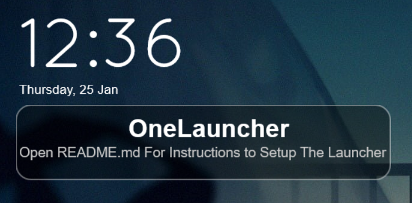

# One Launcher
This is an Application Launcher for Rainmeter.

## Features
- Different Tabs for your different applications.
- Each Tab can have different wallpapers
- Automatically Generate app shortcuts for different tabs from file.

## Working

There are two skins in this root config.
-   IconBar
-   WidgetArea

IconBar is what you see in the top right, WidgetArea is what holds the shortcuts. You generate these using the `shortcut_gen.py` file.

## How to Install
### Part 1 : Loading The Skin
1. Install Rainmeter, and make sure you can run python3.
2. Download The `OneLauncher.rmskin` file.
3. Once Loaded you should see this.

_Congratulations ! You Made it Here!_

### Part 2 : Adding the Shortcuts
In the root folder, you will find a `Shortcut-Catalog` file. In this file, you will describe each of the different sections and what apps are included in them.

```
+Section1
-App1Name,PathToImage,PathToShortcut
-App2Name,PathToImage,PathToShortcut

+Section2
-App1Name,PathToImage,PathToShortcut
```

When you start a line with a `+`, that means You are making a new tab/section. i.e, To make a Game Tab. Write `+Game`.

When you start a line with a `-`, that means you are cataloging an app shortcut that you want in this menu. You have to write this information seperated by commas, Without any spaces. For example, to add notepad, I might write.

```
-Notepad,notepad.png,notepad.exe
```

Let's use this as a demo `Shortcut-Catalog`

```
+Test1
-Notepad,notepad.png,notepad.exe

+Test2
-Explorer,explorer.png,explorer.exe
```
Now, run the `shortcut_gen.py` script.

We get the following.


If you click on the Notepad button. It should now open Notepad, and if we click on the other tab icon, we get this.


So now you know how to add tabs and shortcuts! Now you just need to add images.

### Part 3 : Adding The Images

To add images for the icons and tabs, go to where your rainmeter skins are located. Then open OneLauncher.


Open the `@Resources` folder.


To add Images to the IconBar. Make a png file with the name of the section, and put it in the IconBar folder. 

```
+Test1
-Notepad,notepad.png,notepad.exe

+Test2
-Explorer,explorer.png,explorer.exe
```

Here, we have 2 sections. Test1 and Test2. So we go to the @Resources\IconBar folder and add corresponding files.


If we run the `shortcut_gen.py` script again !


We have successfully added icons to the IconBar !

Now, for the shortcuts. Go back to the `@Resources` folder, and go to the `Shortcuts` folder.

This is where you'll add your shortcut icons.


This has to be the same name as we wrote in our `Shortcut-Catalog`. Now if we run the `shortcut_gen.py` script again.


This is how to set up the Menu ! Now if you click on the buttons, it will run the program !