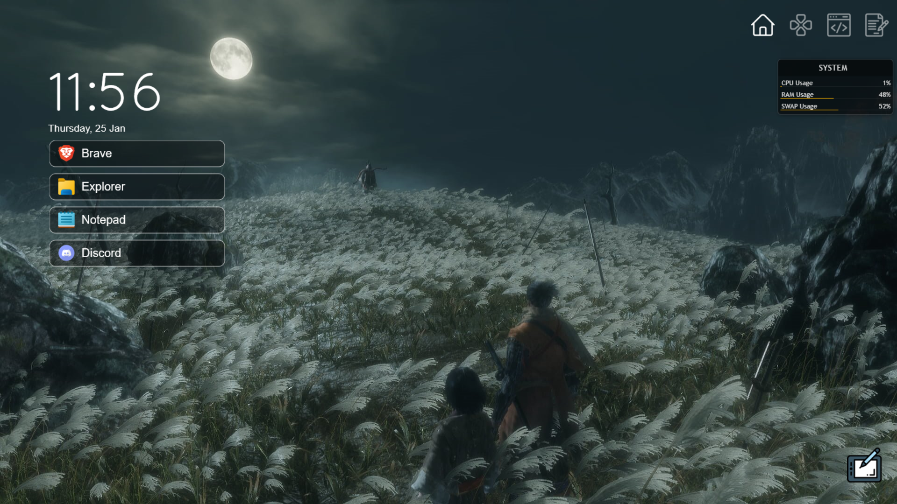

# One Launcher
This is an Application Launcher for Rainmeter.

## Features
- Different Tabs for your different applications.
- Each Tab can have different wallpapers
- Automatically Generate app shortcuts for different tabs from file.

## Working

There are two skins in this root config.
-   IconBar
-   WidgetArea

IconBar is what you see in the top right, WidgetArea is what holds the shortcuts. You generate these using the `shortcut_gen.py` file.

## How to Install

1. Install Rainmeter, and make sure you can run python3.
2. Download This Repository into Where your Rainmeter Skins are stored, and load FirstLaunch.ini